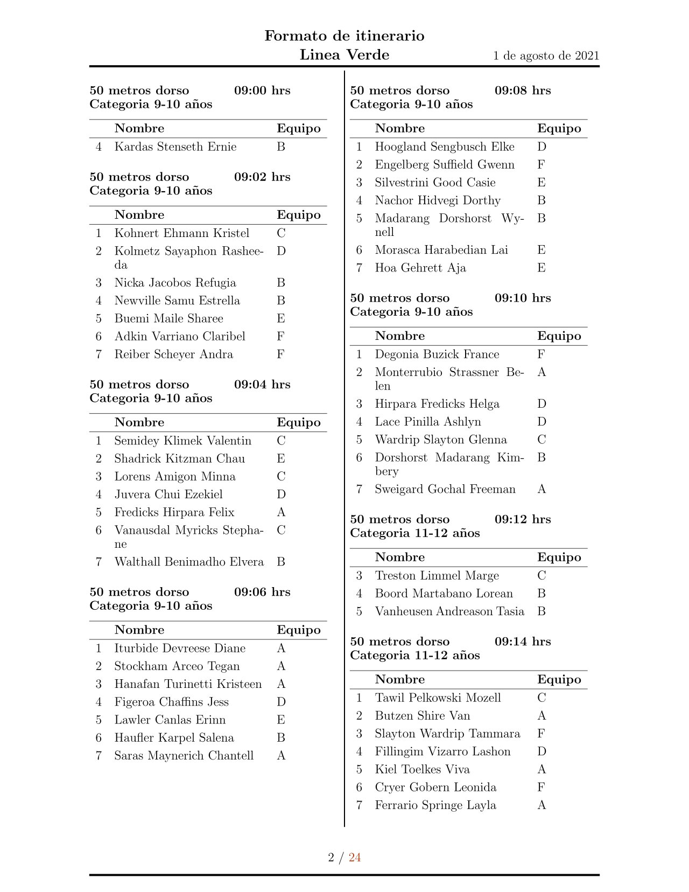

### Competencias de natación - Logística

#### Descripción

Automatización de la creación del itinerario a partir de una base de datos y análisis de tiempos para su organización de menor a mayor en base a su categoria y pruebas.

#### Descarga

```bash
git clone https://github.com/giovannilopez9808/Competencia_2021 Competencia
```

#### Archivos

- **create_schedule.py**:
  Crea el itinerario a partir de la base de datos en formato csv.

- **create_time_data**:
  Crea el archivo donde se guardaran los resultados de la competencia en base a los datos.

#### Plantilla del itinerario de las pruebas



#### Uso

Para el uso de esta plantilla crea una branch de la siguiente manera:

```bash
git branch <nombre_del_proyecto>
```

Los datos deberan ser guardados en la carpeta data con el nombre `data.csv`.
